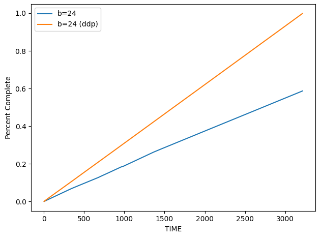

This project modifies the BERT pre-training and finetuning [code](https://github.com/NVIDIA/DeepLearningExamples/tree/master/PyTorch/LanguageModeling/BERT) released by NVIDIA by:
* Splitting the feature generation, training and evaluation code in separate files
* Speeding up feature generation by distributing the computation over multiple CPUs using Python's multiprocessing pool library
* Enabling distributed data parallel training and removing all references to Nvidia apex.amp library and replacing them with native Pytorch DDP, mixed precision forward and backward pass and gradient scaling


Generative vs not

## 1. Generating features for finetuning a pre-trained BERT model using the SQuAD dataset
First step in fine-tuning the BERT model is to generate the features used during training. In the original code released by NVIDIA, feature generation is part of training code (see `read_squad_examples` and `convert_examples_to_features` in `run_squad.py`). I've broken this out into a separate file `prepare_data.py`. You can run this as follows:

```python
python prepare_data.py --input_file=workspace/bert/data/v1.1/train-v2.0.json
--vocab_file=workspace/bert/vocab/uncased_L24_H-1024_A-16.vocab.txt
--version_2_with_negative
--do_lower_case
--nproc=8
--do_merge
```

Except do_merge and nproc, the other arguments are identical to those in `run_squad.py`, so I refer you to the documentation in NVIDIA's repo. 

`nproc` is simply the number of processes the computations involved in feature preparation are distributed across. If the actual number of CPUs on your system is fewer than `nproc`, the code will adjust for that, while leaving some cores for other purposes, helping avoid system hangs.

To understand the `do_merge` argument, we must delve into the feature generation implementation. The implementation proceeds in two steps. In step 1, the raw Squad data (training or evaluation) is split up into SquadExamples. This is done in the `create_squad_example` function. For every context (collection of a paragraph and set of questions and answers based on it), it loops through the questions, answers pairs. For the questions that are possible to answer given the information in the context, it creates a SquadExample object consisting of the context, question, answer and the position of the starting and ending words of the answer in the context. Note that the start and end positions of the answer in the context are provided in characters in the original dataset. The `create_squad_example` function maps the position in characters to the corresponding word. 

In step 2, the SquadExamples are converted into InputFeatures. This is done in the `convert_example_to_features` function. This function takes each SquadExample and does the following:
* Tokenize each word in every SquadExample using the specified Tokenizer and maintain a mapping between the tokens and words
* Replace each token by its corresponding id in the vocabulary
* If the total number of tokens in query and document including the special tokens CLS, SEP is larger than the maximum BERT span, the context is broken into multiple chunks. There can be overlap between successive chunks, this overlap is controlled by the `doc_stride` parameter. The chunks that don't contain the answer to the query are discarded during training, because there is point in retaining those. A sequence of query, document and special tokens is called a feature. A single SquadExample can result in multiple features
* Padding tokens are added to each feature so that the total number of tokens is equal to the `max_seq_len`
* A mask is created that contains 1 for real (non-padding) tokens and 0 for padding tokens. This is used to ensure that only real tokens are attended to during the forward pass

A SquadExample can result in multiple features. A feature is augmented by the index of the SquadExample that it comes from and a serial number. 

The above is an embarrassingly parallel calculation, because each context in the input doc can be processed in parallel to generate SquadExamples and each SquadExample can be processed in parallel to create InputFeatures. 

`do_merge = True` implements one parallel implementation of this workflow. The input context generator is set up by looping over each context and yielding it. This generator is passed to the pool.map function of the Python multi-processing library to process each context in parallel. Processing each context results in a list of SquadExamples which are passed back to the main function and consolidated into a master list of SquadExamples.

```python
def stream(input_data):
    '''
    :param iterable to iterate through
    :return: a single item from the input
    '''
    for idx, entry in enumerate(tqdm(input_data)):
        yield idx, entry
```
The consolidated list of SquadExamples is further processed in parallel to generate the InputFeatures. The implementation should be easy to understand and step through. As with any multi-processed implementation, these guidelines are good to follow.

 * Don't use up all of your system CPUs. The number of processes in your process pool should be fewer than the number of CPUs on your system
 * Use the Queue class from the multiprocessing module to send/receive data across processes. This pipelines data processing and data transfer
 * Data exchange across processes must be kept as low as possible. Don't pass large objects (eg., tokenizer) to mapped functions. Data is automatically pickled when passed to a process and unpickled before mapped function execution begins. The overhead of passing large data, and the associated pickling/unpickling can kill your multiprocessing performance
 * Global variables can be used to pass large objects to multiple processes. This is safe to do because each process gets its own copy of global variables. This can be done in two ways:
     * The main process sets the global variable. When multiple processes are spawned, they see the initialized value of the global variable [see tokenizer initialization]
     * You can use the initargs of the initializer function while creating the process pool. The initial process state can be provided in this function. I use this mechanism to provide each process an ID. The main process puts numbers from 0 to nproc into a Queue. This Queue is provided to the initializer function as the initargs. In the initializer function, each process pulls an ID from the queue, and sets a global variable. BEcause the put/get operations are process-safe, each process will get a unique ID. 

    Note that because each process runs in its own Python VM and gets a separate copy of global variables, your RAM usage will scale up with number of processes, which can exhaust your system RAM. This can happen in the default implementation of Distributed Data Parallel training where the DataLoader on each process loads the full training dataset. If the training data is large, you can quickly exhaust your system RAM. More on this later. 
 * I haven't tested this, but I don't think order is maintained when items are passed to mapped functions. Multi-processing works best when the order in which items are processed doesn't matter. Trying to impose order execution will require synchronization across processes, which is messy to implement and result in slower execution
 
* Partial function are a useful syntactic sugar to pass arguments that don't change per mapped function call. See create_squad_examples_parallel for details
```python
create_squad_example_partial = functools.partial(create_squad_example, version_2_with_negative, is_training)
```
* If you need a variable whose state must be synced across processes [eg., a process-pool wide count], you can use `mp.Value`. Getting/setting these variables must be done under locks. I use this technique to increment the feature count, which must be modified under a lock because its state is shared by all worker processes involved in calculating features

```python
global shared_cnt
local_val = 0
with shared_cnt.get_lock():
    local_val = shared_cnt.value
    shared_cnt.value += 1

```

 
 
The diagram above shows the overall flow, with multiprocessing. The process-safe queues are created implicitly by the pool.imap function. I ran the multi-processed implementation for varying number of processes and recorded the execution time for the `convert_examples_to_features` function. The [plot](https://docs.google.com/spreadsheets/d/1FqgV6DCg2dqmXr2PVK2SbBx2EPTd212siUa5MTt_umw/edit?usp=sharing) below shows the results.


As can be seen, the processing time decreases almost linearly until number of CPUs > 10. After numCPUs = 12, it nearly flattens, implying no improvement in processing time with addition of CPUs. 
 
 We have a multiple producer, single consumer system here, with the multiple processes writing features to the queue and the main process consuming from this queue by removing each feature and appending to a master list. Surmising that perhaps writing to the queues becomes the bottleneck once the number of processes exceeds a certain number (because perhaps the main process is not able to consume fast enough and the queue becomes full, making the producer processes wait), I came up with another solution where instead of sending the features back to the main process, each worker process appends to a local features list. After all SquadExamples have been processed, I call a save function on each worker process, where each list of features is saved to a local file. To keep the file names distinct, each process appends its ID to the file name. Then, I read these files sequentially in the main process and append the features to a master list (and also remove the temporary feature files created by the worker processes). 
 
 
 The image above shows this new workflow [do_merge = False]. However, a bit to my disappointment, the execution time of this workflow was almost exactly the same as the first option [on my 20 core Ubuntu workstation, there may be improvements on larger machines]
 
 ## 2. Running fine-tuning on the Squad dataset
 
I have removed all references to NVIDIA apex.amp module and replaced it with the equivalent Pytorch's code. As stated in the [apex repo](https://github.com/NVIDIA/apex), apex is now deprecated and all apex related changes have been migrated to Pytorch. I have also significantly simplified the code by removing feature generation and evaluation code in separate files.

You can run Distributed Data Parallel (DDP) training using the features created in the data prep step with this command:
```python
python bert_finetuning_squad_no_amp.py
--bert_model=bert-base-uncased
--output_dir=results
--init_checkpoint=workspace/checkpoints/bert_base.pt
--vocab_file=workspace/bert/vocab/uncased_L24_H-1024_A-16.vocab.txt
--config_file=workspace/bert/configs/base.json
--do_train
--train_file=workspace/bert/data/v1.1/train-v2.0.json
--version_2_with_negative
--do_lower_case
--log_interval=5
--log_dir=results
--model_type=bert_small
--use_tensorboard=True
--train_batch_size=24
--fp16
--world_size=2
--gradient_accumulation_steps=1
```
If the SquadExample and InputFeatures pickles created in the data prep steps are not found, the program will exit. 

The mixed precision and Distributed Data Parallel related code changes are the following:
1. Wrap the BERT Model in DDP, if world_size (typically number of GPUs on your system) > 1:
     ```python
    if world_size > 1:
        model = DDP(model, find_unused_parameters=True)
    ```
2. Initialize Pytorch GradScaler it mixed precision is enabled:
    ```python
    scaler = None
    if args.fp16:
        scaler = GradScaler()
    ```
  Gradient Scaling is required during mixed precision training, because when expressed in fp16, gradients may underflow to 0. To prevent underflow, gradient scaling multiplies the network’s loss(es) by a scale factor and invokes a backward pass on the scaled loss(es). Gradients flowing backward through the network are then scaled by the same factor. Because gradient values have a larger magnitude, they don’t flush to zero. The scale factor is adjusted when the GradScalar is stepped to take advantage of full dynamic range of fp16.

3. Create a DistributedSampler if world_size > 1
    ```python
            if world_size == 1:
                train_sampler = RandomSampler(train_data)
            else:
                train_sampler = DistributedSampler(train_data, rank=rank, num_replicas=world_size, drop_last=True, shuffle=False)
    ```
4. Use Pytorch auto_cast for mixed precision training
    ```python
            for step, batch in enumerate(train_iter):
                with torch.autocast(device_type='cuda', dtype=torch.float16):    
    ```
 As mentioned in Pytorch's [autocast documentation](https://pytorch.org/docs/stable/amp.html#autocasting), the backward pass and stepping the GradScalar and Optimizer should be done outside autocast. If gradient accumulation is used, we should wait until backward has been called sufficient number of times before unscaling the gradients and stepping the GradScalar. 
 
 The figure below shows the percent complete for an epoch vs time. DDP (orange graph) on 2 GPUs is almost twice as fast (takes 57% as much time) as training on 1 GPU 
 
 
 The plots below the loss progression, learning rate for training over 1 and 2 GPUs (using mixed precision, with batch size = 24). As you can see, the loss progression graphs look similar and the fine-tuned model achieves similar F1 scores on the evaluation dataset. 
 
 
 
 
 ## Profiling 
 Launching Nsights systems UI
 ```shell script
$ /usr/local/cuda-11.8/nsight-systems-2022.4.2/bin/nsys-ui
```
 
 
 
 
 
 The profiler tells us that all-reducing gradients across the GPUs takes about 10% of the time. This overhead explains why the training time with 2 GPUs is a bit higher than half the training time with 1 GPU. 
 
 ## Evaluation
 